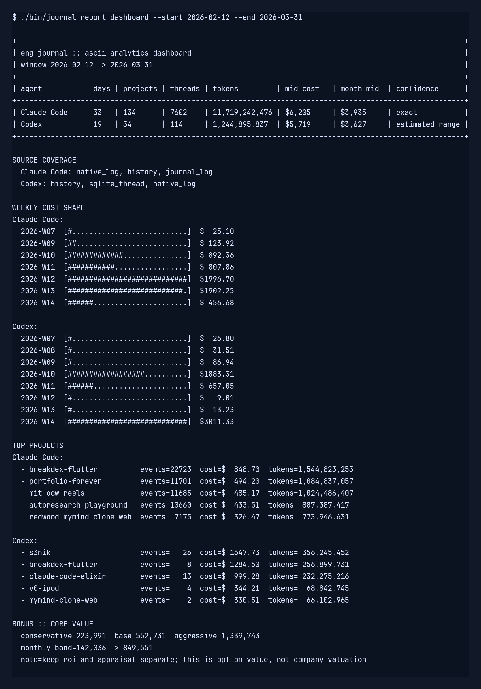
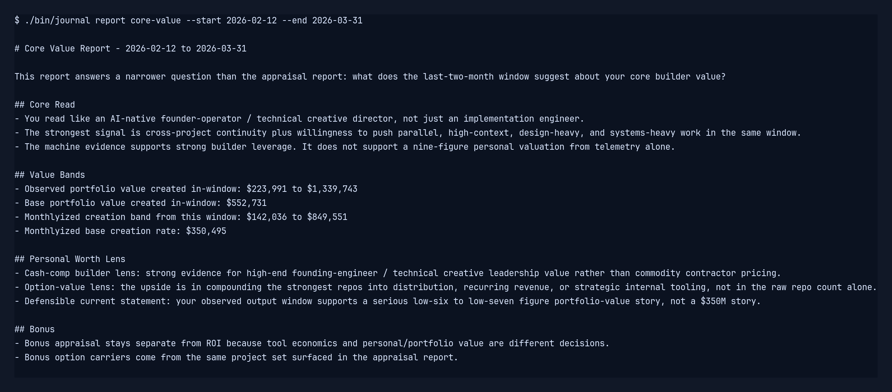

# eng-journal

Standalone engineering journal and ROI analytics for local Claude Code and Codex usage.

The repo ingests raw local activity, normalizes both agents into one period dataset, and produces:

- CHARM-style ASCII dashboards
- daily Markdown journals
- weekly rollups
- prompt-efficiency reports
- ROI scorecards with subscription sensitivity tables
- appraisal reports with conservative, base, and aggressive option-value bands
- core-value reports for the observed builder window

The ingestion layer is Python-only and uses the standard library. The ROI scoring layer runs in Common Lisp through `sbcl`.

## Commands

```bash
./bin/journal doctor
./bin/journal ingest --start 2026-02-12 --end 2026-03-31
./bin/journal report dashboard --start 2026-02-12 --end 2026-03-31
./bin/journal report roi --start 2026-02-12 --end 2026-03-31
./bin/journal report appraisal --start 2026-02-12 --end 2026-03-31
./bin/journal report core-value --start 2026-02-12 --end 2026-03-31
./bin/journal report weekly --start 2026-02-12 --end 2026-03-31
./bin/journal report prompts --start 2026-02-12 --end 2026-03-31 --agent codex
./bin/journal report daily --date 2026-03-31
./bin/journal capture screenshots --start 2026-02-12 --end 2026-03-31
```

Generated reports land in `reports/`.

## Portable Discovery

The loader is no longer tied to one laptop layout. It discovers the latest local sources automatically and also supports explicit overrides:

- `ENG_JOURNAL_CLAUDE_DIR`
- `ENG_JOURNAL_CODEX_DIR`
- `ENG_JOURNAL_CC_CONFIG_DIR`

Claude source precedence is:

- native project logs
- prompt history
- `cc-config/logs/*.jsonl` fallback and supplemental action coverage

Codex source precedence is:

- latest `state_*.sqlite`
- `history.jsonl` prompt history
- latest `logs_*.sqlite` diagnostics

## ASCII Dashboard

```text
+---------------------------------------------------------------------------------------------------------+
| eng-journal :: ascii analytics dashboard                                                                |
| window 2026-02-12 -> 2026-03-31                                                                         |
+---------------------------------------------------------------------------------------------------------+
| agent          | days | projects | threads | tokens         | mid cost   | month mid  | confidence      |
+---------------------------------------------------------------------------------------------------------+
| Claude Code    | 33   | 134      | 7602    | 11,719,242,476 | $6,205     | $3,935     | exact           |
| Codex          | 19   | 34       | 114     | 1,244,895,837  | $5,719     | $3,627     | estimated_range |
+---------------------------------------------------------------------------------------------------------+
```

## Screenshots

ASCII outputs can be rendered into committed terminal-style PNGs:





## Data sources

- `~/.claude/projects/**/*.jsonl`
- `~/.claude/history.jsonl`
- `~/Desktop/cc-config/logs/*.jsonl`
- `~/Desktop/cc-config/logs/.stats.json`
- `~/.codex/history.jsonl`
- `~/.codex/state_*.sqlite`
- `~/.codex/logs_*.sqlite`

## Pricing notes

Claude costs are computed exactly when native usage fields are present.

Codex local telemetry currently exposes `tokens_used` per thread but not a full input/output split, so Codex report costs are shown as a low/high range plus a blended midpoint estimate.

Subscription payback is shown as a sensitivity table because local auth does not expose a definitive ChatGPT/Codex plan tier.

## Repo Files

- `README.md`: repo purpose, commands, and source-of-truth usage
- `PROGRESS.md`: current implementation status and next gaps
- `hyperdata.json`: structured repo metadata, current windows, report inventory, and appraisal framing
- `CHANGELOG.md`: semantic-release changelog target

## Valuation Scope

The appraisal report is intentionally separate from the ROI report.

- ROI answers: are the tools paying back their subscription and compute-equivalent cost?
- Appraisal answers: what are the delivered artifacts, continuity, and option value plausibly worth as a portfolio?

That separation keeps the engineering journal grounded while still giving you a structured way to appraise the work.
